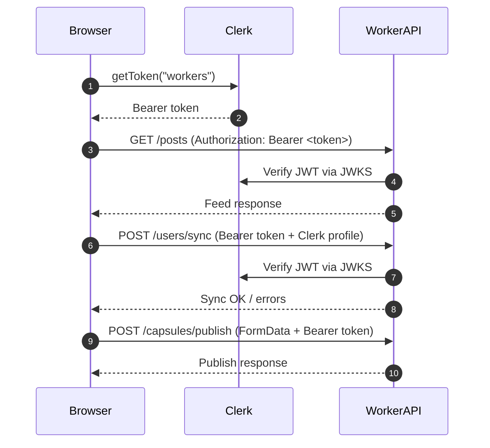

# Cross-Surface Auth Handshake

Clerk issues the primary session cookies, and the SPA requests scoped JWTs via `useAuth().getToken({ template: "workers" })`. Protected flows (feed interactions, studio, publish) must reuse that session to talk directly to the Worker API. This document captures the request path plus the automated proof we run when landing auth-sensitive changes.

## Request Path: Feed → Studio → Worker

1. **Feed** `postsApi.list` asks `useAuth().getToken({ template: "workers" })`, then calls `${getWorkerApiBase()}/posts?...` with `Authorization: Bearer <worker-token>`.
2. **Studio entry** mounts `EnsureUserSynced`, which uses Clerk client hooks to call `ensureUserSynced({ user, token })`. That helper POSTs directly to `${getWorkerApiBase()}/users/sync` with the normalized profile.
3. **Worker API** handlers such as `syncUser` and `capsules/publish` use `requireUser` to verify the JWT via Clerk JWKS, enforce that the `sub` matches the body payload, and reject mismatches with `E-VIBECODR-0404`.
4. **Publish / heavy actions** like `capsulesApi.publish` submit `FormData` straight to `${getWorkerApiBase()}/capsules/publish`, so the Worker receives the same signed bearer token and can audit/authorize the action against plan + quota state.

## Token Propagation Diagram

## Regression Guards

- `apps/web/lib/user-sync.test.ts` ensures `ensureUserSynced` only POSTs once per session, retries on failure, and targets the Worker base URL.
- The Worker `syncUser` handler requires `requireUser`, validates that request bodies reference the authenticated subject, and returns `E-VIBECODR-0404` when mismatched.
- Use this doc to update the diagram whenever we add new surfaces (e.g., moderation tooling, quota enforcement) so the checklist stays honest.
