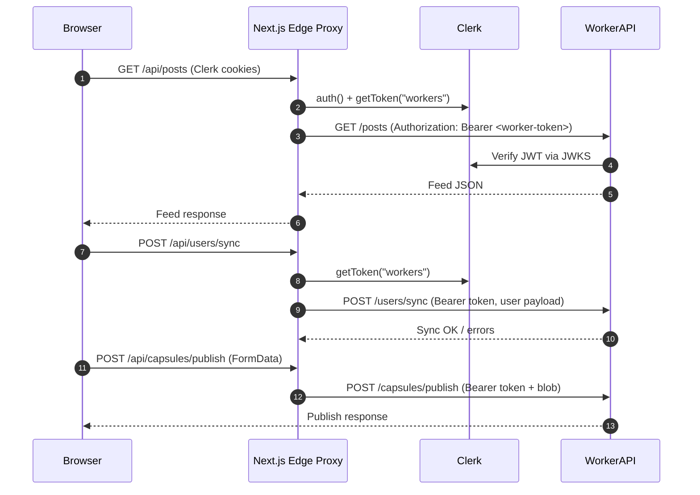

# Cross-Surface Auth Handshake

Clerk issues the primary session cookies that live on the Pages runtime. Protected flows (feed interactions, studio, publish) must reuse that session to talk to the Worker API. This document captures the request path plus the automated proof we run when landing auth-sensitive changes.

## Request Path: Feed → Studio → Worker

1. **Feed** `postsApi.list` calls `/api/posts?...` on the Pages runtime. The catch-all proxy in `apps/web/app/api/[...path]/route.ts` strips hop-by-hop headers, calls `auth().getToken({ template: "workers" })`, and forwards the request to `${WORKER_API_BASE}/posts?...` with `Authorization: Bearer <worker-token>`.
2. **Studio entry** calls `ensureUserSynced()` which POSTs `/api/users/sync`. That route now pulls the same worker token, injects it in the `Authorization` header, and sends the Clerk-normalized profile to the Worker.
3. **Worker API** handlers such as `syncUser` and `capsules/publish` use `requireUser` to verify the JWT via Clerk JWKS, enforce that the `sub` matches the body payload, and reject mismatches with `E-VIBECODR-0404`.
4. **Publish / heavy actions** like `capsulesApi.publish` go through the catch-all proxy, so the Worker receives the same signed bearer token and can audit/authorize the action against plan + quota state.

## Token Propagation Diagram

## Regression Guards

- `apps/web/lib/__tests__/crossSurfaceAuth.test.ts` spins up the feed → studio → publish call chain and asserts that every Worker-bound request carries the Clerk worker token.
- The Worker `syncUser` handler requires `requireUser`, validates that request bodies reference the authenticated subject, and returns `E-VIBECODR-0404` when mismatched.
- Use this doc to update the diagram whenever we add new surfaces (e.g., moderation tooling, quota enforcement) so the checklist stays honest.
